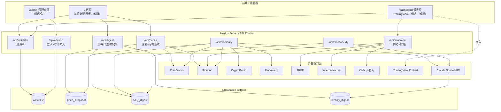

# design.md — 技術設計

> 技術設計的單一真相來源。修改者：AI 主導，重大架構決策入 `log.md`；**視覺品味決定屬人類**。

---

## 技術選型

| 項目 | 選擇 | 為什麼選這個（→ log.md DECISION） |
|---|---|---|
| 框架 | **Next.js（App Router）** | 前後端一體，server component / API route 可把所有機密 API 呼叫關在 server 端（對齊 spec.md 工程紅線 3）；與 Vercel 原生整合，部署最省事。→ log:DECISION-001 |
| 部署平台 | **Vercel** | 與 Next.js 同源、push 即部署、內建 Cron；免費方案足夠單人專案。→ log:DECISION-001 |
| 資料庫 | **Supabase（Postgres）** | 免費額度大、獨立通用（不被 Vercel 綁死）、有現成 JS client 與 CLI、後台可直接改資料（admin 介面未做前的後備手段）。→ log:DECISION-002 |
| 排程 | **Vercel Cron** | 內建、零額外服務；以 `CRON_SECRET` 保護排程端點。注意免費方案 cron 頻率限制——本專案僅每日 1 次 + 每週 1 次，遠低於限制。→ log:DECISION-003 |
| AI 摘要 | **Claude Sonnet（Anthropic API）** | 摘要/解讀品質需求高於成本（一天僅跑一次，token 成本極低）；用 Sonnet 不用 Haiku 是品質取捨。→ log:DECISION-004 |
| K 線圖 | **TradingView Embed Widget** | 免費可嵌入、自帶全部技術指標與時間框架，免自存 K 線、免自算指標。→ log:DECISION-005 |
| 加密/貴金屬價格 | **CoinGecko API** | 一次涵蓋 6 幣 + PAXG + KAG，單一資料源。→ log:DECISION-006 |
| 美股價格+新聞 | **Finnhub API** | 同一 key 同時給美股現價、個股新聞、大盤新聞、VIX，免費額度寬。→ log:DECISION-006 |
| 加密新聞 | **CryptoPanic API** | 聚合加密媒體、有看漲/看跌標籤，免費額度夠。→ log:DECISION-006 |
| 宏觀/國際新聞 | **Marketaux API** | 涵蓋廣、可關鍵字篩選 Fed/通膨/地緣，補國際形勢與總經兩類。→ log:DECISION-006 |
| 總經硬數據 | **FRED API** | 官方、免費無限制，提供 CPI/利率/DXY/10Y/失業率。→ log:DECISION-006 |
| 加密恐懼貪婪 | **Alternative.me API** | 官方免費穩定。→ log:DECISION-006 |
| CNN 美股恐懼貪婪 | **CNN 非官方內部端點** | 無官方 API；直接打其網站內部端點，比第三方中間商乾淨。**性質：盡力而為、可能失效，須容錯。** → log:DECISION-007 |

---

## 系統結構

**模組職責邊界：**

- **前端頁面**：只負責呈現與輪詢，不持有任何機密 key，所有資料經自家 API route 取得。
- **API routes（server）**：唯一能讀環境變數機密、呼叫外部 API 的地方。對外回傳已標準化、已降級處理的 JSON。
- **Cron 端點**：被 Vercel Cron 觸發，驗 `CRON_SECRET`；負責「寫入」型工作（快照、摘要生成、清理），與「讀取」型 API 分離。
- **Supabase**：唯一持久化層。前端不直連 DB，一律經 server。

---

## 對外介面

> 本專案的「對外介面」即內部 API routes（無對外公開 SDK）。

| 端點 | 方法 | 輸入 | 輸出 | 副作用 | 錯誤 |
|---|---|---|---|---|---|
| `/api/watchlist` | GET | — | 啟用標的陣列 | 無 | 500 → 前端用空陣列降級 |
| `/api/prices` | GET | — | `[{symbol, price, changePct\|"closed", category}]` | 無（讀快照+即時現價） | 個別源失效該項標降級值 |
| `/api/digest?type=daily\|weekly` | GET | type | 最新一份摘要 JSON | 無 | 無資料回 `null` |
| `/api/sentiment` | GET | — | `{cryptoFG, vix, cnnFG, macro:{cpi,fedRate,dxy,t10y,unemployment}}`，每項可為 `"unavailable"` | 無 | 個別項失效標 `"unavailable"`，不整體報錯 |
| `/api/admin/login` | POST | `{username, password}` | 設 session cookie | 寫 cookie | 401 帳密錯 |
| `/api/admin/watchlist` | POST/PATCH | 標的物件 | 更新後清單 | **寫 DB** | 未登入 401 |
| `/api/cron/daily` | POST | `Authorization: Bearer CRON_SECRET` | 執行摘要 | **寫 DB、呼叫付費 API** | 401 secret 錯 |
| `/api/cron/weekly` | POST | 同上 | 執行週報 | **寫 DB、呼叫付費 API** | 401 |

**破壞性變更判定（breaking change）**：以下任一即為 breaking，須入 `log.md`（決策＋不可逆風險）並先寫回滾預案——

- 改動 `/api/*` 既有欄位的名稱或型別（前端依賴）
- 改動 Supabase 表的欄位名/型別/刪欄（已有資料）
- 改變 `changePct` 的語意（如從「9:00 定格」改成別的基準）

---

## 視覺與介面

**設計語言（對照式宣告）：**

- **首頁**：像「**緊湊的財經儀表報**」，不像「寬鬆的部落格」。資訊密度高、一頁盡量收下五類摘要 + 價格牆、少捲動。
- **儀表頁**：像「**交易終端**」，不像「行銷落地頁」。深色為主、數據密集、儀表感強。

**設計系統重點：**

- 主題：深／淺可切換，**預設深色**；切換狀態存 cookie/localStorage。
- 顏色：漲跌用色須在深淺兩主題都清楚（建議漲綠跌紅，或依最終品味；色票待設計階段定）。
- 核心元件：價格卡片（現價＋定格漲跌）、新聞摘要條目（標題＋繁中摘要＋來源連結）、半圓指針情緒儀表、總經數據格、TradingView 嵌入容器、商品側欄列。

**主要畫面清單（引用 spec.md 功能 ID）：**

| 畫面 | 對應功能 |
|---|---|
| 首頁新聞區 | F-10, F-11, F-12 |
| 首頁價格牆 | F-05, F-06, F-12 |
| 儀表頁 K 線區 | F-13 |
| 儀表頁側欄 | F-14 |
| 儀表頁情緒儀表 | F-15, F-16, F-17 |
| 儀表頁總經儀表 | F-18 |
| admin 登入 + 管理 | F-19, F-20 |

**✅ 視覺拍板（2026-05-30）**：

1. **整體風格參考**：**TradingView 風** — 深底交易終端、密集面板、monospace 數字、緊湊填充。對齊 spec.md「儀表頁像交易終端」+「首頁像緊湊財經儀表報」。
2. **漲跌配色**：**綠漲紅跌**（歐美財經標準）。
   - 漲：emerald `#10b981`（Tailwind `emerald-500`），dark mode 用 `emerald-400`
   - 跌：rose `#ef4444`（Tailwind `rose-500`），dark mode 用 `rose-400`
   - 持平/未知：zinc-500 / zinc-400
3. **背景與卡片色階**：
   - dark：背景 `zinc-950` / 卡面 `zinc-900` / 邊框 `zinc-800`
   - light：背景 `zinc-50` / 卡面 `white` / 邊框 `zinc-200`
4. **字型**：sans 用 Geist Sans、數字用 Geist Mono + `tabular-nums`（對齊欄位）。

**交給 Claude Design 的工作**：依上述設計語言與主要畫面，從文字/參考圖產生互動原型、建立設計系統、打包 handoff bundle 交 Claude Code 轉程式碼。**驗收走 Playwright MCP 自動截圖比對**，人類只做最終品味確認。

---

## 風格與慣例

> 主要靠工具承擔，指向設定檔；此處只記工具管不到的。

- Linter/Formatter：ESLint + Prettier（設定檔 `.eslintrc`、`.prettierrc`，待建立）
- 型別：使用 TypeScript，外部 API 回應一律先定義型別再使用
- 命名慣例：API route 回傳欄位用 camelCase；Supabase 欄位用 snake_case；在 server 邊界做轉換
- 錯誤處理慣例：所有外部 API 呼叫包 try/catch，失敗回「降級值 + 狀態旗標」，**禁止靜默吞例外**（spec.md 工程紅線 2）
- 禁用語法：禁用 `eval`；禁止在 client component 引入任何含機密的模組

---

## 部署與環境

| 環境 | 用途 | 差異 |
|---|---|---|
| local | 本機開發 | 用 `.env.local`；可指向 Supabase 開發專案 |
| production | 線上（Vercel） | 環境變數在 Vercel 後台設定；Cron 啟用 |

**部署步驟：**

1.（一次性）Vercel 連 GitHub repo、設定所有環境變數、連 Supabase
2. push 到 main → Vercel 自動 build & deploy
3. Vercel Cron 設定：`/api/cron/daily` 每日台北 09:00（UTC 01:00）、`/api/cron/weekly` 週一台北 09:00

**框架強制**：repo 含 `vercel.json` 設 `"framework": "nextjs"`，避免新環境/重建 project 時 Vercel 偵測成 "Other" 走錯 builder（見 log CHANGE-002）。

**自動化程度**：build/deploy 全自動；**人類確認點**＝首次 production 部署、環境變數變更、schema migration（皆屬 ai-rules.md「需確認」項）。

**時區注意**：Vercel Cron 以 UTC 設定。台北 09:00 = UTC 01:00。排程設定須寫 UTC 並在程式內以 `Asia/Taipei` 計算「前一日」與「9:00 快照」邏輯，避免日界線錯誤。

---

## 回滾預案（不可省）

| 變更類型 | 回滾步驟 | 時間窗 | 回滾失敗的次選 |
|---|---|---|---|
| 程式碼（前端/API） | Vercel 後台 → Deployments → 選上一個成功部署 → Promote/Rollback | 即時（< 1 分鐘） | `git revert` 該 commit 後 push 重新部署 |
| 環境變數 | Vercel 後台改回舊值 → redeploy | 數分鐘 | 從本機 `.env.local` 備份比對還原 |
| Supabase schema | 用反向 migration 還原；migration 前先 `supabase db dump` 備份 | 視資料量 | 從 dump 還原整表（會丟新進資料，需評估） |
| 依賴 | `git revert` package.json/lock → `npm install` → 重部署 | 數分鐘 | 鎖定到已知良好版本號重裝 |
| 資料（壞掉的摘要/快照） | 該筆為快取性質，刪除後等下次排程重生，或手動觸發 cron 補跑 | 即時 | 手動 SQL 修正單筆 |

**原則**：任何 production 部署前，對應變更類型的回滾路徑必須已寫在此表。schema 變更前**必先 dump 備份**。

---

## 已知問題（技術債 + 故障處理，按嚴重度排序）

> 開發初期暫無實際故障紀錄；以下為**可預期**故障的處理預案，開發中補實。

| 嚴重度 | 症狀 | 緩解（具體指令/動作） | 驗證 | 根因（選填） |
|---|---|---|---|---|
| 中 | CNN 情緒儀表顯示「暫無資料」 | 屬預期容錯，非故障。確認 `/api/sentiment` 其餘欄位正常即可。若需修：檢查 CNN 端點是否改版，更新抓取邏輯 | `curl /api/sentiment` 回傳 JSON 其餘欄位有值 | CNN 非官方端點改版 |
| 中 | 早上首頁無當日摘要 | 檢查 Vercel Cron 執行記錄；手動補跑 `curl -X POST .../api/cron/daily -H "Authorization: Bearer $CRON_SECRET"` | `/api/digest?type=daily` 回傳今日資料 | Cron 未觸發或外部新聞源逾時 |
| 中 | 美股價格全部「休市」但其實開盤 | 檢查 Finnhub 回應的 market status 解析；確認台北/紐約時區換算 | `/api/prices` 美股項 `changePct` 為數字 | 時區判斷錯或 Finnhub 限流 |
| 低 | 漲跌% 看起來不對 | 確認昨日與今日 09:00 兩筆 `price_snapshot` 都存在；查 `price_snapshot` 表 | 兩筆快照時間戳正確、計算 `(今-昨)/昨` 吻合 | 快照漏抓（cron 某日失敗） |
| 低 | Anthropic API 逾時/限流致摘要缺類 | cron 內對五類分別呼叫並各自 try/catch，缺的類別下次補；可手動重觸發 | `daily_digest` 五類齊全 | API 限流 |
